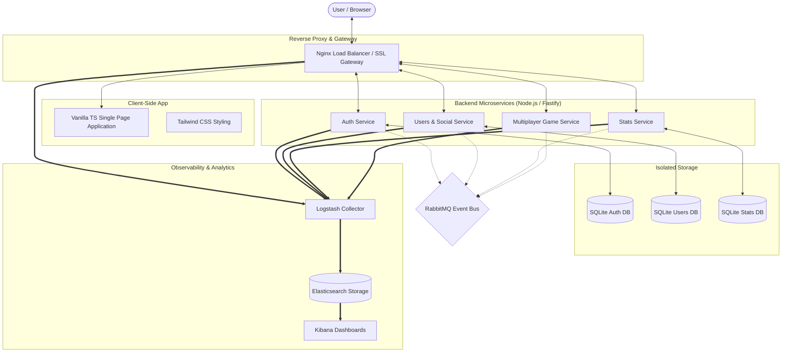

# ft_transcendence 🎮🚀

```text
 .-') _   _  .-')     ('-.         .-') _   .-')                 ('-.       .-') _  _ .-') _     ('-.       .-') _             ('-.   
(  OO) ) ( \( -O )   ( OO ).-.    ( OO ) ) ( OO ).             _(  OO)     ( OO ) )( (  OO) )  _(  OO)     ( OO ) )          _(  OO)  
/     '._ ,------.   / . --. /,--./ ,--,' (_)---\_)   .-----. (,------.,--./ ,--,'  \     .'_ (,------.,--./ ,--,'  .-----. (,------. 
|'--...__)|   /`. '  | \-.  \ |   \ |  |\ /    _ |   '  .--./  |  .---'|   \ |  |\  ,`'--..._) |  .---'|   \ |  |\ '  .--./  |  .---' 
'--.  .--'|  /  | |.-'-'  |  ||    \|  | )\  :` `.   |  |('-.  |  |    |    \|  | ) |  |  \  ' |  |    |    \|  | )|  |('-.  |  |     
   |  |   |  |_.' | \| |_.'  ||  .     |/  '..`''.) /_) |OO  )(|  '--. |  .     |/  |  |   ' |(|  '--. |  .     |//_) |OO  )(|  '--.  
   |  |   |  .  '.'  |  .-.  ||  |\\    |  .-._)   \\ ||  |`-'|  |  .--' |  |\\    |   |  |   / : |  .--' |  |\\    | ||  |`-'|  |  .--'  
   |  |   |  |\\  \\   |  | |  ||  | \\   |  \\       /(_'  '--'\\  |  `---.|  | \\   |   |  '--'  / |  `---.|  | \\   |(_'  '--'\\  |  `---. 
   `--'   `--' '--'  `--' `--' `--'  `--'   `-----'    `-----'  `------'`--'  `--'   `-------'  `------'`--'  `--'   `-----'  `------' 
```


A high-performance, containerized **Microservices Platform** featuring a real-time multiplayer Pong game, secure authentication, centralized logging, and a custom Single Page Application (SPA) built entirely from scratch with **Vanilla TypeScript**.

---

## 🕹️ Core Features & User Experience

This platform replicates a classic competitive gaming hub, focusing on seamless real-time interactions and robust user security:

*   **⚡ Real-Time Multiplayer Pong:** Fast-paced, responsive Pong matches synced over WebSockets. Features accurate collision detection, smooth paddle movements, and multiple game modes (including Classic and custom rulesets).
*   **🤖 Local & AI Match Play:** Play offline locally by sharing a keyboard with a friend (1v1 local), or practice your skills against an intelligent AI bot.
*   **🤝 Matchmaking & Queues:** Join the global matchmaking queue to automatically find players of similar skill levels, or directly invite online friends to competitive custom game lobbies.
*   **💬 Integrated Chat System:** 
    *   **Direct Messages (DMs):** Chat privately with other users in real time.
    *   **Chat Rooms / Channels:** Create public, private, or password-protected group channels.
    *   **Moderation Controls:** Channel owners can appoint administrators, mute, or ban users.
    *   **User Blocking:** Instantly block other users to prevent them from sending direct messages or appearing in your active chats.
*   **👥 Social Network & Friends list:** Follow other players, track their real-time status (Online, Offline, In-Game), view their profile metrics, and invite them directly to matches.
*   **👤 Custom User Profiles & Stats:** Detail-rich player profiles displaying global rank, match histories (wins, losses, dates, scores), customizable avatars, and customizable game themes (paddle colors, ball skins).
*   **🔒 Secure Auth & Two-Factor Authentication (2FA):** Protected user registration and login endpoints utilizing secure JSON Web Tokens (JWT). Includes optional, production-grade **2FA** integration (using TOTP via Authenticator apps like Google Authenticator) for enhanced profile security.

---

## 🏗️ System Architecture

This project is built using a decentralized **Microservices Architecture** with a **Database-per-Service** pattern, asynchronous message brokers, and centralized logging. 



---

## 🌟 Key Highlights & Strengths (Recruiter Cheat-Sheet)

If you are reviewing this project for a developer role, here are the main engineering strengths demonstrated:

*   **Custom Client-Side SPA (No React/Vue overhead):** Built a custom component rendering lifecycle, client-side router, state hooks, and fetch interceptors in Vanilla TypeScript. This demonstrates a deep, fundamental understanding of browsers, routing, DOM manipulation, and asynchronous rendering.
*   **Database-per-Service Isolation:** Services maintain completely isolated SQLite databases via Fastify, preventing database coupling. Microservices communicate exclusively through well-defined APIs or asynchronous events.
*   **Asynchronous Event-Driven Architecture:** Utilizes **RabbitMQ** to publish and subscribe to system-wide events (e.g., matchmaking states, user statistics updates, authentication changes). This minimizes HTTP blocking, increases system throughput, and decouples services.
*   **Observability-Driven Development (ELK Stack):** Features a production-ready monitoring pipeline. All containers route structured logs via Docker’s **GELF driver** to **Logstash**, indexing them in **Elasticsearch** for search and analysis, visualized in customized **Kibana** dashboards.
*   **Real-time Bi-directional Communication:** Employs high-speed **WebSockets** via Fastify for real-time multiplayer Pong matchmaking, active gameplay synchronization, chat rooms, and real-time online status monitoring.
*   **DevOps & Security First:** Secured through an SSL-configured **Nginx** reverse proxy, handling routing, static asset serving, and security headers. Orchestrated and structured cleanly under **Docker Compose** for instant local deployment.

---

## ⚙️ Tech Stack & Service Matrix

| Service | Language / Runtime | Main Frameworks & Libraries | Database / Storage | Protocols Used | Primary Responsibility |
| :--- | :--- | :--- | :--- | :--- | :--- |
| **`reverse-proxy`** | Nginx | — | — | HTTPS / WSS | API Gateway, SSL/TLS termination, CORS management, and static file routing. |
| **`frontend`** | TypeScript (Browser) | Vanilla TS, Tailwind CSS | LocalStorage | HTTP / WebSockets | Lightweight, zero-framework Single Page Application with custom routing and components. |
| **`auth-service`** | Node.js (v20+) | Fastify, amqplib, dotenv | SQLite (`better-sqlite3`) | HTTP, RabbitMQ (Pub) | Secure authentication, cookie handling, session validation, and user credentials storage. |
| **`users-service`** | Node.js (v20+) | Fastify, Fastify-Websocket, amqplib | SQLite (`better-sqlite3`) | HTTP, WebSockets, RabbitMQ (Pub/Sub) | Profile management, friendship status, active status (online/offline) via WebSockets. |
| **`stats-service`** | Node.js (v20+) | Fastify, amqplib | SQLite (`better-sqlite3`) | HTTP, RabbitMQ (Sub) | Player analytics, history tracking, win/loss rates, and global leaderboards. |
| **`backend/game`** | Node.js (v20+) | Fastify, Fastify-Websocket | In-Memory State | WebSockets, RabbitMQ (Pub) | Live multiplayer Pong mechanics, physics loops, active matchmaking queue, game room logic. |
| **`monitoring/elk`** | Java (Elastic) | Elasticsearch, Logstash, Kibana | Elasticsearch Indexes | TCP / UDP (GELF) | Aggregates all container outputs, structures logs, and generates infrastructure metrics dashboards. |

---

## 📂 Project Structure

```text
├── auth-service/       # Auth microservice (Fastify + SQLite)
├── users-service/      # Users profiles and social networks (Fastify + WebSockets)
├── stats-service/      # Player history & statistics aggregator (Fastify + SQLite)
├── backend/
│   └── game/           # High-speed Pong multiplayer game engine (Fastify + WebSockets)
├── frontend/           # Custom Vanilla TypeScript SPA (Custom Router + Tailwind CSS)
│   ├── src/
│   │   ├── api/        # REST client integrations
│   │   ├── components/ # Reusable Vanilla TS UI Components
│   │   ├── hooks/      # State & data fetching helpers
│   │   ├── pages/      # View controllers (Lobby, Profile, Login, Game)
│   │   ├── sockets/    # WebSocket handlers (Game, Status)
│   │   ├── types/      # TypeScript definitions
│   │   ├── router.ts   # Custom SPA routing engine
│   │   └── main.ts     # Client application bootstrap
├── reverse-proxy/      # Nginx Gateway configuration (HTTPS / Routing)
├── monitoring/
│   └── elk/            # ELK pipeline configurations (Logstash pipeline, Elasticsearch)
└── docker-compose.yaml # Local orchestration of all microservices
```

---

## 🚀 Getting Started

### Prerequisites

*   Docker (v20.10+)
*   Docker Compose (v2.0+)

### Quick Start

1.  Clone this repository:
    ```bash
    git clone https://github.com/FedeDiazDev/ft_transcendence.git
    cd ft_transcendence
    ```
2.  Configure your environment file (copy and adapt `.env.example` if available):
    ```bash
    cp .env.example .env
    ```
3.  Build and run the entire platform:
    ```bash
    docker compose up --build
    ```
4.  Open your browser and navigate to:
    *   **Application Gateway:** `https://localhost:8080` (or `http://localhost:8080` depending on configuration)
    *   **Kibana Observability Dashboard:** `http://localhost:5601` (to view centralized container logs)

---

## 🛡️ Best Practices & Quality Standards

*   **Clean Code & Architecture:** Strict separation of concerns (Layered Backend Architecture: Router -> Controllers -> Models).
*   **Fetch Interceptor Pattern:** Frontend handles transparent token expiration checks and token refreshes gracefully using custom fetch wrappers ([interceptFetch.ts](file:///frontend/src/interceptFetch.ts)).
*   **Scalability & High Performance:** Fastify’s minimal overhead coupled with SQLite's high-speed embedded execution guarantees low resource usage and latency.
*   **Docker GELF Logging integration:** Infrastructure log collection handles container rotation, preventing storage overflow and providing clear insights during system failures.
